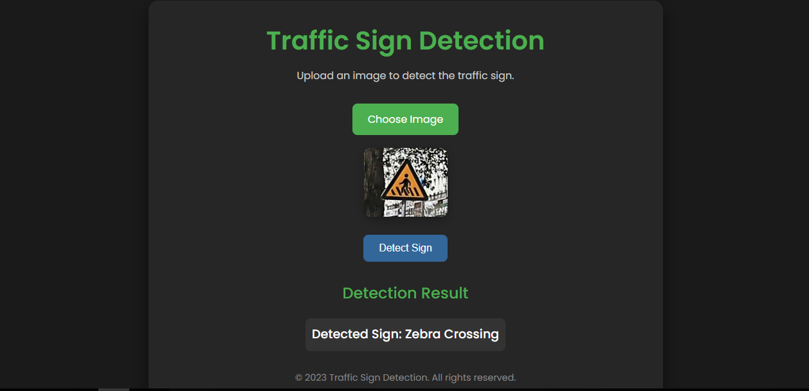

# Traffic Sign Detection and Classification 🚦

This repository contains code for **traffic sign detection and classification**, featuring both traditional machine learning techniques and deep learning approaches. It includes a **Flask-based web application** for real-time traffic sign detection and classification using a pre-trained deep learning model. The project leverages **TensorFlow** for image classification, **OpenCV** for image processing, and **Flask** for the web interface.

 <!-- Add a demo GIF or screenshot here -->

---

## Features ✨
- **Traffic Sign Detection**: Detect traffic signs using Histogram of Oriented Gradients (HOG) features and a Random Forest classifier.
- **Traffic Sign Classification**: Classify traffic signs using a deep learning model based on transfer learning with the InceptionV3 architecture.
- **Web Application**: A user-friendly Flask-based web app for uploading images and viewing detection results in real-time.
- **Data Preprocessing**: Includes image resizing, normalization, and data augmentation for improved model performance.
- **High Accuracy**: Achieves **97.62% accuracy** with the InceptionV3 model and **92.07% accuracy** with the Random Forest classifier.

---

## Technologies Used 🛠️
- **Backend**: Flask (Python)
- **Frontend**: HTML, CSS, JavaScript
- **Machine Learning**: TensorFlow, Keras, Scikit-learn
- **Image Processing**: OpenCV, Pillow
- **Data Handling**: Pandas, NumPy
- **Model Architectures**: InceptionV3 (Transfer Learning), Random Forest

---

## Workflow Overview 🧠

### 1. Data Preprocessing
- Class labels are loaded from CSV files.
- Images are resized, normalized, and preprocessed for feature extraction and classification.
- Data augmentation is applied to the training set for improved model generalization.

### 2. Traffic Sign Detection with HOG Features
- **Histogram of Oriented Gradients (HOG)** features are extracted from each image.
- A **Random Forest classifier** is trained to detect traffic signs.
- Model performance is evaluated using accuracy and a classification report.

### 3. Traffic Sign Classification with Transfer Learning
- **Transfer learning** is used with the **InceptionV3** architecture pre-trained on ImageNet.
- Additional layers are added for traffic sign classification.
- The model is trained and evaluated using training and validation sets.

### 4. Web Application
- Users can upload an image of a traffic sign via the web interface.
- The pre-trained TensorFlow model predicts the traffic sign class.
- The detected traffic sign name is displayed on the web page.

---

## Installation and Setup 🚀

### Prerequisites
- Python 3.8 or higher
- pip (Python package manager)

## Results 📊
- InceptionV3 Model: Achieves an accuracy of 97.62% on the validation set.
- Random Forest Classifier: Achieves an accuracy of 92.07% on the test set.

## Usage 🖥️
1. Upload an Image:

    - Click the "Choose Image" button to upload an image of a traffic sign.

    - Supported formats: JPG, PNG, JPEG.

2. Detect Traffic Sign:

    - Click the "Detect Sign" button to classify the traffic sign.

    - The detected sign name will be displayed below.
  

---

## Application Interface

